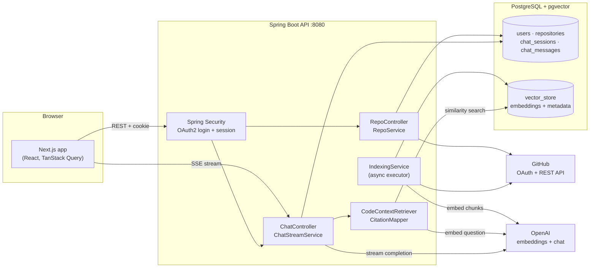
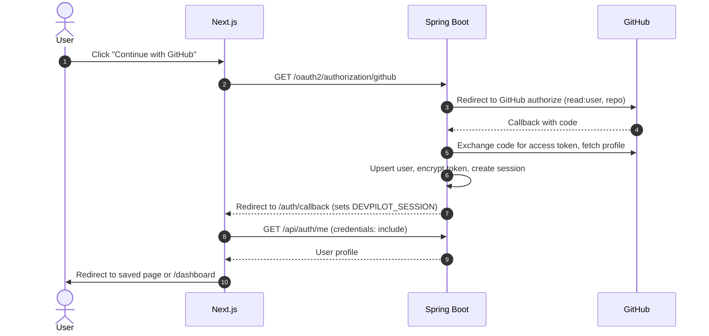
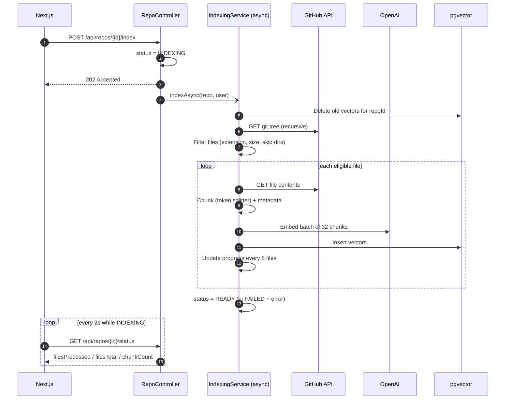
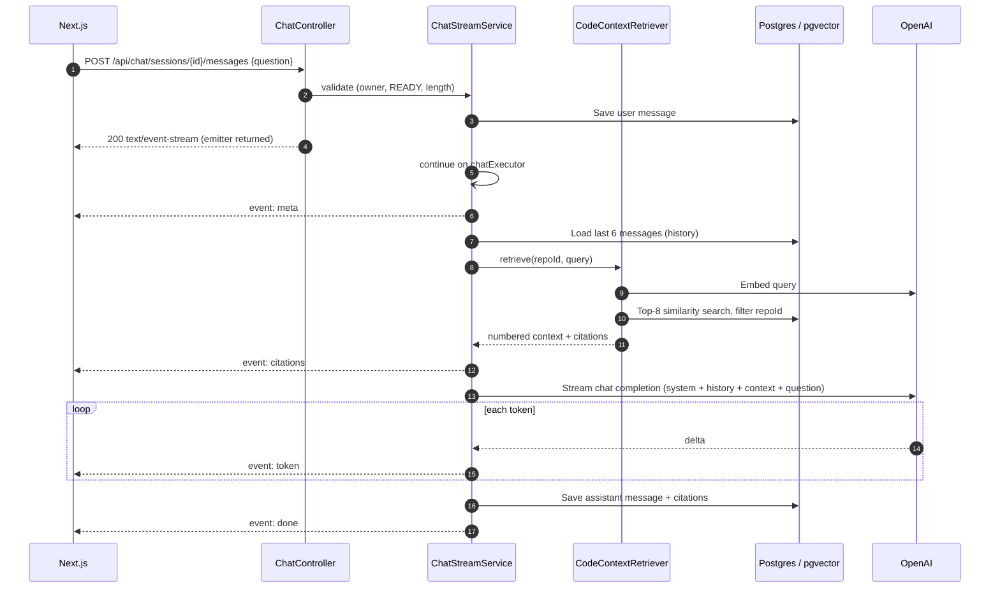
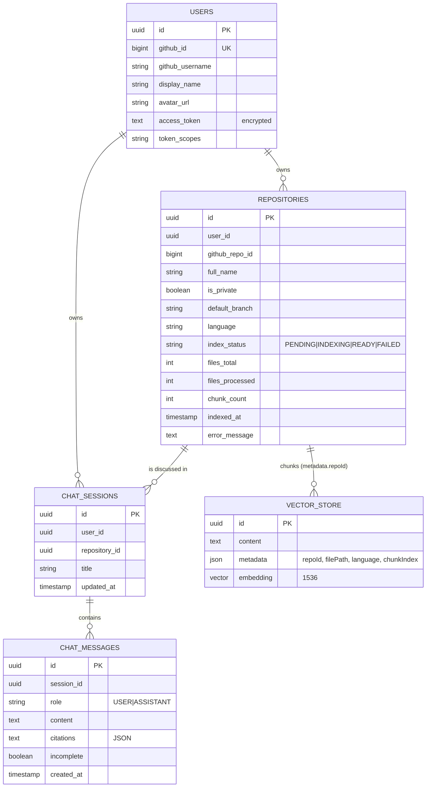

# DevPilot

**Chat with your GitHub codebases.** Sign in with GitHub, pick any public or private repository, and ask questions about the code in plain English. Every answer is grounded only in that repository's code and cites the files it came from.

DevPilot is a retrieval-augmented generation (RAG) application built with **Spring Boot, Spring Security, Spring AI, PostgreSQL + pgvector** and a **Next.js** frontend.

---

## Table of contents

- [Features](#features)
- [Tech stack](#tech-stack)
- [System design](#system-design)
  - [Architecture](#architecture)
  - [Authentication flow](#authentication-flow)
  - [Repository sync](#repository-sync)
  - [Indexing pipeline](#indexing-pipeline)
  - [Question answering (RAG)](#question-answering-rag)
  - [Streaming protocol (SSE)](#streaming-protocol-sse)
  - [Data model](#data-model)
- [API reference](#api-reference)
- [Project structure](#project-structure)
- [Getting started](#getting-started)
- [Configuration](#configuration)
- [Design decisions](#design-decisions)
- [Security](#security)
- [Limitations and roadmap](#limitations-and-roadmap)

---

## Features

- **GitHub sign-in** with OAuth2. Works with public and private repositories (`read:user`, `repo` scopes).
- **Repository sync** pulls every repository you can access, with language, visibility and default branch.
- **Background indexing** reads the repository tree, filters out noise, chunks code and stores embeddings in pgvector. Progress is shown live.
- **Grounded chat** answers only from retrieved code, cites sources as `[n]`, and says so when the code doesn't contain the answer.
- **Token-by-token streaming** over Server-Sent Events, with stop/cancel and partial answers saved.
- **Chat history** per repository, with follow-up questions that use conversation context.
- **Citations UI**: hover a `[n]` marker to see the file, click to jump to the source, open the file on GitHub.
- **Code search** page to inspect exactly which chunks retrieval returns for a question.

## Tech stack

| Layer | Technology |
|---|---|
| Frontend | Next.js (App Router), React 19, TypeScript, Tailwind CSS v4, shadcn/ui (Base UI), TanStack Query, react-markdown |
| Backend | Java 21, Spring Boot 4, Spring Security (OAuth2 client), Spring Data JPA, Spring AI 2 |
| AI | OpenAI `gpt-4o-mini` (chat), `text-embedding-3-small` (1536-dim embeddings) |
| Data | PostgreSQL 16 with `pgvector` (HNSW index, cosine distance) |
| External | GitHub REST API |
| Local infra | Docker Compose |

---

## System design

### Architecture



The backend is a single Spring Boot service. Long-running work (indexing, answer generation) runs on dedicated thread pools (`indexingExecutor`, `chatExecutor`) so request threads are released immediately.

### Authentication flow

The session cookie (`DEVPILOT_SESSION`, HTTP-only) belongs to the backend origin, so the frontend checks the session by calling `/api/auth/me` rather than reading cookies.



Signed-in routes are wrapped in a client-side `AuthGuard`. A 401 from `/api/auth/me` stores the current path and redirects to `/login`, so the user returns to where they were after signing in.

### Repository sync

`GET /api/repos?refresh=true` fetches all repositories the user can access (owner, collaborator, organization member) page by page, upserts them by `(user_id, github_repo_id)`, and removes repositories that no longer exist on GitHub. `refresh=false` returns the stored list without calling GitHub, which is what the dashboard loads first.

### Indexing pipeline



| Stage | Details |
|---|---|
| File filter | Allowed source/config extensions; skips `node_modules`, `.git`, `dist`, `build`, `target`, `.next`, `vendor`, lock files, and files above `app.indexing.max-file-bytes` (100 KB) |
| Chunking | Spring AI `TokenTextSplitter`, about 200 tokens per chunk; each file's first chunk is prefixed with `// File: <path>` |
| Metadata | `repoId`, `filePath`, `language`, `chunkIndex` (used for filtering and citations) |
| Storage | Spring AI `PgVectorStore`, 1536 dimensions, HNSW index, cosine distance |
| Rate limiting | `GithubRateLimiter` pauses between GitHub calls (`app.github.api-delay-ms`) |
| Status | `PENDING → INDEXING → READY` or `FAILED`, with file and chunk counters |

### Question answering (RAG)



**Prompt design**

- **System prompt:** answer only from the provided context, cite blocks as `[n]`, say when the context is insufficient, never invent files, and treat code as data rather than instructions (prompt-injection guard).
- **Context:** the top 8 chunks, formatted as numbered blocks (`[1] path (lines a-b)` followed by a fenced code block). The number matches the citation's position, so `[n]` in the answer maps directly to `citations[n-1]`.
- **History:** the last 6 messages are sent as plain turns, without their old context, to keep the prompt small.
- **Follow-ups:** questions under 6 words (for example "and where is it tested?") are combined with the previous question for retrieval.
- **Message objects:** prompts are built from `SystemMessage` / `UserMessage` objects rather than templates, so `{braces}` in code or questions are never treated as template variables.

### Streaming protocol (SSE)

The answer endpoint is a `POST`, so the browser reads it with `fetch` and a stream reader (`EventSource` only supports `GET`). Every event's `data` is JSON.

| Event | Payload | When |
|---|---|---|
| `meta` | `{ session, userMessage }` | Immediately; the session is renamed after its first question |
| `citations` | `CitationDto[]` | After retrieval, before any tokens |
| `token` | `{ text }` | For each streamed piece of the answer |
| `done` | `{ message }` | The saved assistant message |
| `error` | `{ message }` | The model failed; the partial answer is saved as `incomplete` |

If the client disconnects (the user presses **Stop**, closes the tab or times out), the backend cancels the OpenAI request and saves the partial answer with `incomplete = true`. Validation errors (blank question, repository not indexed) are returned as normal JSON `400`s before streaming starts.

On the frontend, tokens are batched per animation frame before re-rendering Markdown, and the thread keeps following new output unless the user scrolls up.

### Data model



Every query is scoped by `user_id`, so users can only see their own repositories, sessions and messages.

---

## API reference

All `/api/**` endpoints require an authenticated session (cookie). Errors use the shape `{ status, error, message, timestamp }`.

| Method | Path | Description |
|---|---|---|
| `GET` | `/api/auth/me` | Current user |
| `GET` | `/api/auth/login-url` | OAuth entry point URL |
| `POST` | `/api/auth/logout` | End session (204) |
| `GET` | `/api/repos?refresh=true\|false` | Sync with GitHub, or list stored repositories |
| `GET` | `/api/repos/{id}` | One repository |
| `GET` | `/api/repos/{id}/status` | Indexing status and progress |
| `POST` | `/api/repos/{id}/index` | Start (re-)indexing (202) |
| `POST` | `/api/repos/{id}/retrieve` | `{ question }` → `{ citations, contextText }` (retrieval only) |
| `GET` | `/api/repos/{repoId}/chat/sessions` | Chat sessions for a repository |
| `POST` | `/api/repos/{repoId}/chat/sessions` | Create a session (201) |
| `GET` | `/api/chat/sessions/{id}` | Session with all messages |
| `DELETE` | `/api/chat/sessions/{id}` | Delete a session (204) |
| `POST` | `/api/chat/sessions/{id}/messages` | `{ question }` → `text/event-stream` answer |

GitHub API failures are mapped to clear responses: rate limit → `429`, revoked or expired token → `401`, other failures → `502`.

---

## Project structure

```
.
├── backend/                         Spring Boot API
│   └── src/main/java/devPilot/backend/
│       ├── config/                  Security, CORS, crypto, executors
│       ├── controllers/             Auth, Repo, Retrieval, Chat
│       ├── dto/                     Request/response records
│       ├── entity/                  JPA entities (User, Repository, ChatSession, ChatMessage)
│       ├── exceptions/              Global error handling
│       ├── repository/              Spring Data repositories
│       ├── security/                OAuth2 user service, current-user helper
│       └── services/
│           ├── ai/                  Retrieval, citations, prompts, RAG settings
│           ├── chat/                Session persistence, SSE streaming
│           ├── github/              GitHub API client, rate limiter
│           └── indexing/            File filter, chunker, async indexing
├── client/                          Next.js frontend
│   ├── app/
│   │   ├── page.tsx                 Landing page
│   │   ├── login/, auth/callback/   Sign-in flow
│   │   └── (app)/                   Signed-in area (AuthGuard)
│   │       ├── dashboard/           Repository list, sync, indexing
│   │       └── repos/[id]/          Repo details, code search, chat
│   ├── components/                  auth, repos, chat, ui (shadcn)
│   ├── hooks/                       use-auth, use-repos, use-chat
│   └── lib/                         API client, SSE reader, types
├── docker/postgres/                 Extension init script (vector, hstore, uuid-ossp)
└── docker-compose.yml               PostgreSQL 16 + pgvector
```

---

## Getting started

### Prerequisites

- Java 21, Node.js 20+, Docker
- A [GitHub OAuth app](https://github.com/settings/developers) with callback URL `http://localhost:8080/login/oauth2/code/github`
- An OpenAI API key

### 1. Start PostgreSQL

```bash
docker compose up -d
```

This starts PostgreSQL with pgvector on port **5433**.

### 2. Configure and run the backend

```bash
cd backend
cp .env.example .env    # fill in the values below
./mvnw spring-boot:run
```

The API runs on `http://localhost:8080`. Tables and the vector store schema are created automatically on first start.

### 3. Run the frontend

```bash
cd client
npm install
npm run dev
```

Open `http://localhost:3000`, sign in with GitHub, sync your repositories, index one, and start chatting.

---

## Configuration

Secrets are read from `backend/.env` (git-ignored, loaded via `spring.config.import`). Real environment variables take precedence.

| Variable | Description |
|---|---|
| `DB_URL`, `DB_USERNAME`, `DB_PASSWORD` | PostgreSQL connection (defaults match `docker-compose.yml`) |
| `OPENAI_API_KEY` | OpenAI key for embeddings and chat |
| `GITHUB_CLIENT_ID`, `GITHUB_CLIENT_SECRET` | GitHub OAuth app credentials |
| `TOKEN_ENCRYPTOR_PASSWORD`, `TOKEN_ENCRYPTOR_SALT` | Encrypt stored GitHub tokens (salt must be hex). Changing them invalidates stored tokens |
| `FRONTEND_URL`, `CORS_ALLOWED_ORIGINS` | Frontend origin for redirects and CORS (default `http://localhost:3000`) |

Frontend: set `NEXT_PUBLIC_API_URL` in `client/.env.local` if the API is not on `http://localhost:8080`.

Tunable settings live in `application.properties` (`app.indexing.*`, `app.github.api-delay-ms`) and `RagSettings` (`TOP_K_CHUNKS`, `HISTORY_MESSAGES`, `STREAM_TIMEOUT_MS`, `MAX_QUESTION_LENGTH`).

---

## Design decisions

| Decision | Why |
|---|---|
| **pgvector in PostgreSQL** instead of a separate vector database | One datastore for relational data and embeddings; metadata filtering by `repoId` in the same query; simpler local setup |
| **Server-side session cookie** instead of JWTs in the browser | The GitHub token never reaches the browser; HTTP-only cookie limits XSS impact; simple logout |
| **SSE over POST** instead of WebSockets | One-directional token stream fits SSE; works through standard HTTP infrastructure; `fetch` gives abort support |
| **Async executors** for indexing and chat | Request threads are freed immediately; indexing progress is polled; chat streams from a background thread |
| **Numbered context blocks** | Lets the model cite `[n]` and the UI map each marker straight to a source without fuzzy matching |
| **Persisting partial answers** | Stopped or failed answers stay visible after a reload, flagged as incomplete |
| **Client-side auth guard** | The session cookie lives on the API origin, so the browser asking `/api/auth/me` is the reliable source of truth |

## Security

- GitHub access tokens are encrypted at rest (`Encryptors.text`) and only decrypted server-side when calling GitHub.
- Sessions use an HTTP-only `DEVPILOT_SESSION` cookie with `SameSite=Lax`; CORS is restricted to the configured frontend origin.
- Every repository, session and message lookup is scoped to the authenticated user.
- The system prompt instructs the model to treat retrieved code as data, which reduces prompt injection through repository content.
- Secrets are kept out of the repository (`.env` is git-ignored; `.env.example` documents the variables).

## Limitations and roadmap

- [ ] Store start/end line numbers per chunk so every citation links to exact lines
- [ ] Exclude metadata from the embedded text to improve retrieval quality
- [ ] Incremental re-indexing (only changed files since the last indexed commit)
- [ ] Clean up chat sessions when a repository is removed during sync
- [ ] Hybrid retrieval (keyword + vector) and re-ranking
- [ ] Database migrations (Flyway) instead of `ddl-auto=update`
- [ ] Tests for the indexing and chat pipelines, plus CI
